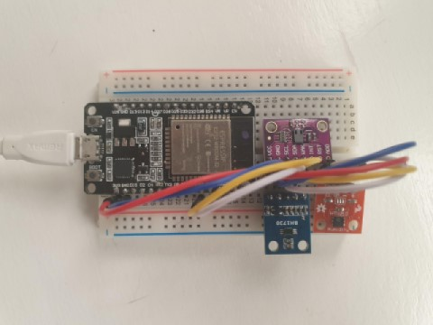

# esp32_BLEtoMQTTBridge

BLE to MQTT Bridge using espressiff esp32 reading nRF52840 BLE-node. As a gateway includes Lux (BH1750), temperature and humidyty (HTU21D), CO2 and TVOC (CCS811)

* TODO

- [ ] This file :)
